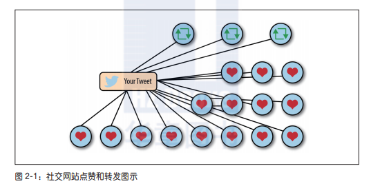
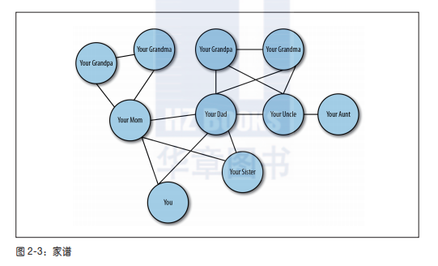
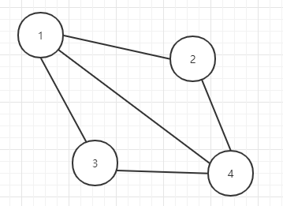
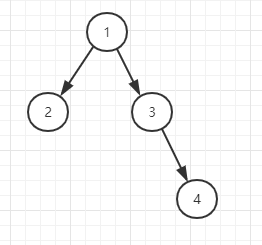
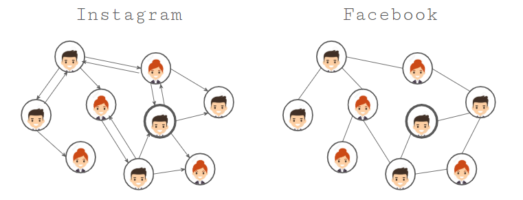

Chapter 2 - Graph Theory
==================
Graph theory is the study of graphs, which are a way to formally represent a collection of interconnected objects. You can think of a graph as an object containing data points and their connections. In computer science, graphs typically describe networks of data.

You don't need to know anything about graph theory to work with GraphQL, but it's fun to learn about the history behind these concepts!


圖論
--------
- 
- 
- 在圖論的世界中,我們可以將圖視為一種物件,它的裡面有資料點和它們的連結。而在電腦科學中,圖通常用來描述資料網路
  + 
    * 在圖論的術語中,以上圖表中有4個代表資料點的圓圈,它們被稱為節點(node)或端點(vertice),節點之間的線條或連結稱為邊(edge)。所以,上述的圖有4個節點與5個邊
    * 以上的圖是一種無向圖(undirected graph),因為節點之間沒有方向性或階層關係。這就代表我們可以從任何地方開始,往任何方向走,在任何地方結束
  + 
    * 以上的圖是一種有向圖(directed graph),它的邊是箭頭,而不是直線
    * 這張圖的節點之間有方向性或流向(flow)
  + 由以下這張圖可以看出,在現實世界中的圖中,Facebook是無向圖,而Instagram是有向圖
    * 


現實世界的圖
--------
- 在Facebook圖中,對任何其他人來說也是如此。只要你單獨查詢某人,並索取他的資料,這個請求看起來就像棵樹。那個人在樹根,你想要取得的所有資料都是子節點。在這個請求中,人藉由一條邊連接他的所有朋友
- person
  + name
  + location
  + birthday
  + friends
    * friend name
    * friend location
    * friend birthday
- 這個結構看起來像個GraphQL query
- ```javascript
    {
      me {
        name
        location
        birthday
        friends {
          name 
          location
          birthday
        }
      }
    }
  ```


Resource Links
--------
* [From REST to GraphQL](https://0x2a.sh/from-rest-to-graphql-b4e95e94c26b): An article about the differences between REST and GraphQL
* [A Gentle Introduction to Graph Theory](https://dev.to/vaidehijoshi/a-gentle-introduction-to-graph-theory): A wonderful look at the core concepts behind graph theory
* [Euler's Solution to the Konigsberg Bridge Problem](http://www.maa.org/press/periodicals/convergence/leonard-eulers-solution-to-the-konigsberg-bridge-problem): A detailed look at the Konigsberg Bridge problem