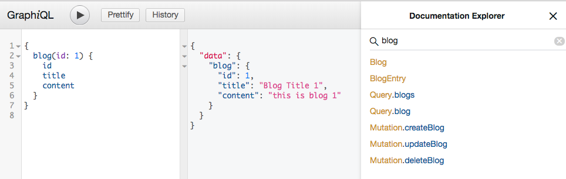

Chapter 3 - The GraphQL Language
==================
In this chapter, we'll start writing GraphQL queries using the GraphQL query language. The query string syntax is consistent for all GraphQL APIs, regardless of what language the service is written in. Throughout this chapter, we'll explore the ins-and-outs of the query language and how a GraphQL operation is parsed by a GraphQL server.


GraphQL 查詢語言
----
- SQL(Structured Query Language)是結構化查詢語言,是用來存取、管理與操作資料庫內資料的領域專用語言
  + SQL可執行的指令相當簡單: `SELECT`、`INSERT`、`UPDATE`、`DELETE`,你只能對資料做這些事情
  + 使用SQL時,我們可以編寫一條查詢指令來取得在資料庫的資料表內互相連接的資料
  + REST架構就是基於以上4種基本的資料操作方法來使用不同的HTTP方法: `GET`、`POST`、`PUT`、`PUT`。但是,如果你想要指定用REST來讀取或改變哪一種類型的資料,唯一的方式就是透過端點URL,不能用實際的查詢語言
- GraphQL將原本用來查詢資料庫的概念應用在網際網路上。我們只要用一個GraphQL query就可以回傳彼此相連的資料
- GraphQL有三種主要類型
  + `query`
  + `mutation`
  + `subscription`
- SQL與GraphQL都是查詢語言,但它們完全不同。它們適用於完全不同的環境
  + **SQL query是傳給資料庫的,而GraphQL query是傳給API的**
  + SQL資料存放在資料表內,而GraphQL資料可存放在任何地方: 資料庫、多個資料庫、檔案系統、REST API、WebSocket,甚至是其它的GraphQL API
  + GraphQL與SQL的語法也完全不同。GraphQL使用`Query`來請求資料,而不是SELECT,這項操作是GraphQL完成每項工作的核心
    * GraphQL將所有的資料改變都包裝成一種型態: `Mutation`,而不是使用`INSERT`、`UPDATE`、`DELETE`
    * 因為GraphQL是讓網際網路所使用的,它有一種Subscription型態可用來監聽通訊端連結上的資料變動; 而在SQL並沒有類似訂閱的東西
  + 結論: SQL是資料庫的查詢語言,而GraphQL是網際網路的查詢語言
- GraphQL是按照規格來標準化的。無論你使用哪一種程式語言都可以實作
  + 其實`query`只是放在POST請求的內文中送給GraphQL端點的字串
  + 下面是一個GraphQL query,它是用GraphQL查詢語言寫成的字串
    * ```js
        {
          allLifts {
            name
          }
        }
      ```
    * 也可以在終端機透過`curl`指令直接發送這個POST請求給GraphQL伺服器,來收到一個JSON回應
    * ```console
        curl 'http://snowtooth.herokuapp.com/' -H 'Content-Type: application/json' --data '{"query":"{ allLifts { name }}"}'
      ```
  + 若要修改資料,你可以傳送mutation(變動)。`Mutation`的目的是改變關於app整體狀態的事物。我們可以使用mutation直接傳送執行改變所需的資料
    * 範例: 若我們希望用mutation來將id為panorama的纜椅改為open狀態
      * ```js
          mutation {
            setLiftStatus(id: "panorama" status: OPEN) {
              name
              status
            }
          }
          ```
      * 我們一樣可以用`curl`指令將這項操作傳送給GraphQL伺服器
      * ```console
          curl 'http://snowtooth.herokuapp.com' -H 'Content-type: application/json' --data '{"query":"mutation {setLiftStatus(id: \"panorama\" status: OPEN) {name status}}"}'
        ```


GraphQL API 工具
----
- GraphQL社群建立了一些可用來和GraphQL API互動的開放原始碼工具。這些工具可讓你用GraphQL查詢語言來編寫query、將這些query送到GraphQL端點,以及查看JSON回應
- 接下來將介紹2種可對著GraphQL API測試GraphQL query的熱門工具
  + [GraphiQL](https://www.electronjs.org/apps/graphiql)
    * GraphiQL是Facebook建造的瀏覽器內部整合式開發環境(IDE),可用來查詢與瀏覽GraphQL API
    * 有許多的公用API都有提供GraphiQL介面以供查詢即時資料
    * 
      * GraphiQL的操作介面非常簡單,裡面有一個可讓你編寫`query` or `mutation` or `subscription`的面板、一個用來執行它的播放按鈕,以及一個顯示回應的面板。當按下Play按鈕來執行這個查詢之後,我們就會在右側面板上收到一個JSON格式的回應
      * 我們也可以點開右上角的Docs視窗,它裡面定義了與目前的服務互動時需要知道的每一件事。這個文件是自動被加入GraphiQL的,因為它是從服務(daemon)的schema讀出來的。schema定義了服務可提供的資料,而GraphiQL會對schema執行一個自我查詢來自動建構文件
      * 我們通常會用提供GraphQL 
  + [GraphQL Playground](https://www.prisma.io/blog/introducing-graphql-playground-f1e0a018f05d)
    * 由Prisma團隊所開發的, 提供與GraphiQL一樣的功能
    * 要與GraphQL Playground互動,最簡單的方法是用瀏覽器前往[GraphQL Bin](https://www.graphqlbin.com/),並輸入一個端點,就可以使用GraphQL Playground來與資料互動了
    * GraphQL Playground有一個重要的功能,就是它可以連同GraphQL request一起傳送HTTP標頭
      * [GraphQL Playground with HTTP header](./GraphQL%20Playground%20with%20HTTP%20header.png)
    * 也可以下載GraphQL Playground的桌機版本
      * $ `brew cask install graphql-playground`
    * 可參考[Public GraphQL APIs](https://github.com/APIs-guru/graphql-apis)裡面的範例做練習
      * [SWAPI](http://graphql.org/swapi-graphql)
        * 這是個Facebook專案,它是SWAPI REST API的包裝
      * [GitHub API](https://developer.github.com/v4/explorer)
        * GitHub GraphQL API是最大型的公用API之一,可讓我們傳送query、mutation來查看與改變GitHub的即時資料
        * 需要先登入自己的GitHub帳號才能使用這個公用API
      * [Yelp](https://www.yelp.com/developers/graphiql)
        * Yelp維護這個可讓你用GraphiQL來查詢的GraphQL API
        * 需要先建立一個Yelp帳號才能與Yelp API裡面的資料進行互動


GraphQL 查詢
----
- 我們可以參考書中範例[Snowtooth Mountain API](http://snowtooth.moonhighway.com),它是一座虛構的滑雪場,我們可以透過這個GraphQL API來提供即時、最新的纜椅和雪道狀態資訊,並且Snowtooth的滑雪巡邏員可以直接透過手機打開、關閉纜椅和雪道狀態資訊
- 可以使用query(查詢)從API請求資料。query描述我們想要從GraphQL伺服器取得的資料。當我們傳送query時,就是以field(欄位)為單位索取資料。這些欄位對應伺服器回傳的JSON資料回應內的同一組欄位
  + ```js
      query {
        allLifts {
          name
          status
        }
      }
      ```
- 當成功地發出的query後,會收到一個含有"資料"鍵的JSON文件。失敗的查詢會收到一個含有"錯誤"的JSON物件,在這個鍵底下的JSON資料就是錯誤的詳細消息。JSON回應也可能同時含有"資料"與"錯誤"
  + 
  + 
- 可以在查詢文件裡面加入多的query,但每此只能執行一項操作
  + 若我們可以在一個查詢文件中加入2項查詢操作時,會引發錯誤,GraphQL Playground會要求我們只能選擇一個query操作
    * 
  + 而從現在開始,我們可以開始漸漸地感受到GraphQL的優點。如果我們想要藉由一個請求來取得所有資料的話,就必須將它們全都放在同一個query裡面。我們可以用一個query操作來來索取各種不同的資料點,我們可以查詢目前處於**特定狀態**的`liftCount`、目前處於那種狀態的纜椅數量、每一個纜椅的`name`與`status`
    * ```js
        query liftsAndTrails {
          liftCount(status: OPEN)
          allLifts {
            name
            status
          }
          allTrails {
            name
            difficulty
          }
        }
      ```
    * 
- Query是一種GraphQL型態。我們稱它為根型態,因為這種形態對應一項操作,而操作是查詢文件的根。query可在GraphQL API中使用的欄位已被定義在該API的schema裡面了,這個schema文件會告訴我們那個Query型態有哪些欄位可以選擇
  + 當我們在編寫query的時候,將需要的欄位放在大括號裡面來選擇他們,這些段落稱為選擇組(selection set),並且也可以在一個選擇組裡面方入另一個選擇組。這就是GraphQL API最大的優點,**我們能夠選擇需要的欄位,以及省略不想要的欄位**
  + GraphQL API回傳的資料為JSON格式,並且使用與query一樣的外型來傳遞。它發出的每一個JSON欄位的名稱都與選擇組的欄位名稱一樣,而我們也可以在query中指定別名來改變回應物件的欄位名稱
    * 
- 可以傳入查詢引數來過濾GraphQL回傳的查詢結果。引數是與一個查詢欄位有關的一對鍵/值(或好幾對)
  + 範例: 假如我們只想要取得被關閉纜椅的名稱,可以傳入一個過濾回應的引數
    * ```js
        query closedLifts {
          allLifts(status: CLOSED) {
            name
            status
          }
        }
      ```
    * 
- 我們也可以使用引數來選擇我們指定要取得的資料
  + 範例: 假如我們要查詢某個纜椅的狀態,可以用它的專屬代碼來選擇它
    * ```js
        query jazzCatStatus {
          Lift(id: "jazz-cat") {
            name
            status
            night
            elevationGain
          }
        }
      ```
    * 


邊與連結
----
- 在GraphQL查詢語言中,欄位可分為**純量型態**或**物件型態**
  + 純量型態類似其他語言中的基本型態。它們是選擇組的葉節點
    * GraphQL內建5種純量型態
      * 整數(Int)
      * 浮點數(Float)
      * 字串(String)
      * 布林(Boolean)
      * 專屬代碼(ID)
  + GraphQL物件型態是在schema內定義的一或多個欄位群組,它們定義了應回傳的JSON物件的外形。由於JSON我們可以藉由查詢某個物件來取得與它有關的物件的細節來將物件連結在一起
    * ```js
        query trailsAccessedByJazz {
          Lift(id: "jazz-cat") {
            capacity
            trailAccess {
              name
              difficulty
            }
          }
        }
      ```
    * 
    * 我們的選擇組包含一個對於`capacity`欄位的請求。`capacity`是純量型態,它會回傳一個代表"一台纜椅可搭載的人數"的整數。`trailAccess`欄位屬於`Trail`型態(物件型態)。在這個範例中,`trailAccess`會回傳一個已經過濾後、可用Jazz Cat抵達的雪道清單。因為`trailAccess`是隸屬於`Lift`型態中的欄位,API可使用父物件(也就是`Jazz Cat Lift`)的資料來過濾回傳的雪道清單
  + 以上的操作範例查詢兩種資料型態(纜椅與雪道)之間的**一對多連結**。一台纜椅與許多與它有關的雪道相連。如果我們從`Lift`節點開始遍歷圖,可透過命名為`trailAccess`的邊前往與該纜椅連接的一個或多個`Trail`節點。如果我們想要從`Trail`節點走回`Lift`節點,因為這張圖是**無向的**,所以可以做到
    * ```js
        query liftToAccessTrail {
          Trail(id:"dance-fight") {
            groomed
            accessedByLifts {
              name
              capacity
            }
          }
        }
      ```
    * 
    * 在`liftToAccessTrail` query中,我們選擇一個名為"Dance Fight"的`Trail`。`groomed`欄位回傳一個布林純量型態,可讓我們知道`Dance Fight`是否被整理過了。`accessedByLifts`欄位回傳可帶著滑雪客前往`Dance Fight`雪道的纜椅


Fragment(片段)
----
- fragment是可在多個操作中重複使用的選擇組
  + 可以將fragment以及其操作的定義加入GraphQL查詢文件中
- ```js
    query {
      Lift (id: "jazz-cat") {
        name 
        status
        capacity
        night
        elevationGain
        trailAccess {
          name
          difficulty
        }
      }
      Trail(id: "river-run") {
        name
        difficulty
        accessedByLifts {
          name
          status
          capacity
          night
          elevationGain
        }
      }
    }
  ```
  + 
  + 以上的query範例,我們想要取得的River Run雪道資訊有一些欄位與`Lift`型態的欄位相同,因此我們可以建立一個fragment來協助減少query重複的地方
    * ```js
        fragment liftInfo on Lift {
          name
          status
          capacity
          night
          elevationGain
        }
      ```
    * fragment是屬於特定型態的選擇組,所以我們必須在fragment的定義中指定它所屬的型態。在這個範例中的fragment稱為`liftInfo`,它是`Lift`型態的選擇組
    * 當我們要在另一個選擇組中加入`liftInfo` fragment欄位時,可在fragment名稱前面加上三個句點(`...`)來做這件事
      * ```js
          fragment liftInfo on Lift {
            name
            status
            capacity
            night
            elevationGain
          }

          query {
            Lift(id: "jazz-cat") {
              ...liftInfo
              trailAccess {
                name
                difficulty
              }
            }
            Trail(id: "river-run") {
              name
              difficulty
              accessedByLifts {
                ...liftInfo
              }
            }
          }
          ```
      * 
- **這種語法類似Javascript的spread運算子,它也有類似的用途---將一個物件的鍵與值指派給另一個物件**。這三個句點(`...`)可讓GraphQL將fragment的欄位指派給當前的選擇組
- fragment有個很棒的優點在於,我們只需要修改一個fragment,就可以修改在許多不同的query裡面的選擇組
  + ```js
      fragment liftInfo on Lift {
        name
        status
      }
      ```
  + 這樣修改`liftInfo` fragment的選擇組會讓使用這個fragment的每一個query選擇較少的資料


聯合型態(Union Types)
----
- 如果我們想要取得含有多個型態的串列,可建立**聯合型態**,它可建立兩種不同的物件型態之間的關係
- 可參考[schedule app](https://graphqlbin.com/v2/ANgjtr)的GraphQL API範例。假如我們想要幫大學生建立一個行程app,讓他們可以在行事曆中加入`Workout`、`Study Group`事件
  + 當我們查看GraphQL Playground內的文件時,會看到`AgendaItem`是一個聯合型態(union types),也就是它可以回傳多種型態。具體來說,`AgendaItem`可回傳`Workout`＆`Study Group`事件,它們都是大學生行事曆裡面可能有的東西
    * 當我們要編寫學生行事曆的query時,可使用fragment來定義當AgendaItem是Workout時想要選擇的欄位,以及當AgendaItem是StudyGroup時想要選擇的欄位
    * ```js
        query schedule {
          agenda {
            ...on Workout {
              name
              reps
            }
            ... on StudyGroup {
              name
              subject
              students
            }
          }
        }
      ```
    * 以下是這個query的回應
      * ```js
          {
            "data": {
              "agenda": [
                {
                  "name": "Comp Sci",
                  "subject": "Computer Science",
                  "students": 12
                },
                {
                  "name": "Cardio",
                  "reps": 100 
                },
                {
                  "name": "Poets",
                  "subject": "English 101",
                  "students": 3
                },
                {
                  "name": "Math Whiz",
                  "subject": "Mathematics",
                  "students": 12
                },
                {
                  "name": "Upper Body",
                  "reps": 10
                },
                {
                  "name": "Lower Body",
                  "reps": 20
                }
              ]
            }
          }
        ```


Resource Links
----

### Query Language Tools
* [GraphiQL](https://github.com/graphql/graphiql): An in-browser IDE for exploring GraphQL APIs.
* [GraphQL Playground](https://github.com/prismagraphql/graphql-playground): A GraphQL IDE for writing queries in the GraphQL Query Language.
* [GraphQL Bin](https://www.graphqlbin.com/v2/new): An online version of GraphQL Playground. Simply enter a GraphQL endpoint, and all of the schema documentation will be present in the `schema` tab. 
* [GraphQL Bin - SWAPI](https://www.graphqlbin.com/RVIn): This link takes you to a SWAPI example in GraphQL Bin.
* [Apollo Launchpad](https://launchpad.graphql.com/new): Apollo's GraphQL Server demo platform
* [什麼是REST? 認識 RESTful API 路由語義化設計風格](https://tw.alphacamp.co/blog/rest-restful-api)
* [[筆記] REST 到底是什麼?](https://medium.com/@jinghua.shih/%E7%AD%86%E8%A8%98-rest-%E5%88%B0%E5%BA%95%E6%98%AF%E4%BB%80%E9%BA%BC-170ad2b45836)
* [Linux Curl Command 指令與基本操作入門教學](https://blog.techbridge.cc/2019/02/01/linux-curl-command-tutorial/)

### Chapter Examples
* [Snowtooth API](http://snowtooth.moonhighway.com): The Snowtooth Mountain GraphQL API
* [Union Types](https://codesandbox.io/s/72kppqr7kq?fontsize=14): Union types sample 
* [Interfaces](https://codesandbox.io/s/p79k2n635x?fontsize=14): Interfaces sample 
